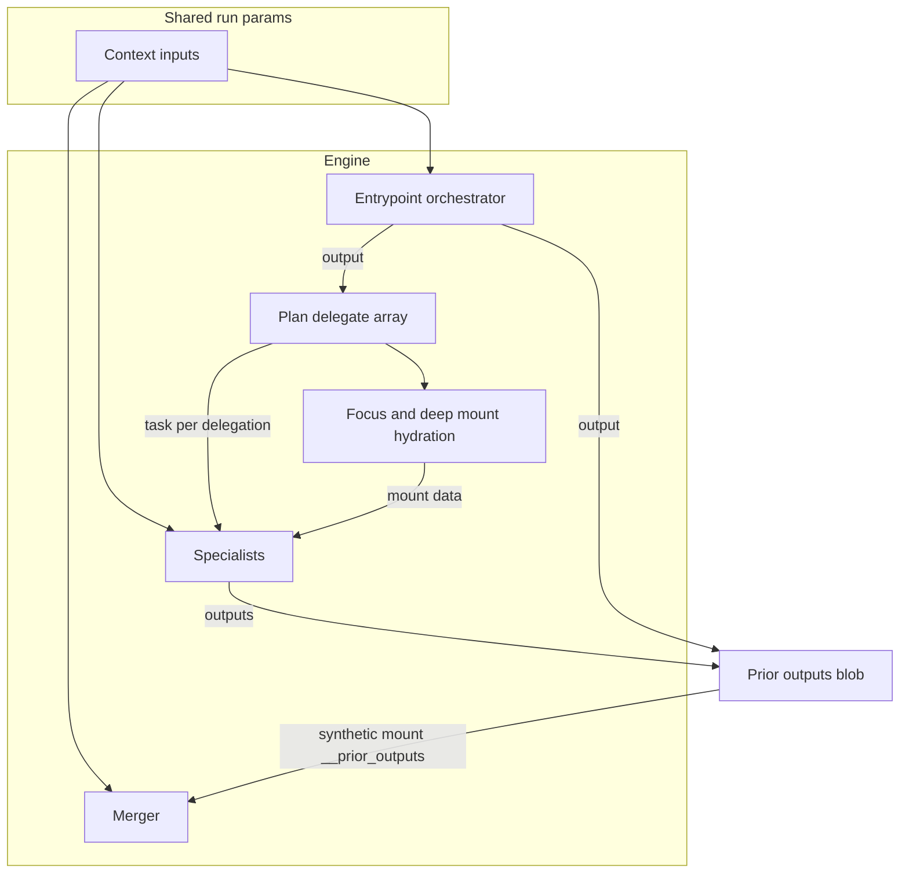

# Spec: Execution Control Protocol (ECP)

## Overview

The **Execution Control Protocol (ECP)** defines a portable specification for configuring, orchestrating, and executing AI agent environments across systems.

ECP is designed to sit **above Model Context Protocol (MCP)** and **alongside Agent-to-Agent (A2A)** communication systems.

The protocol standardizes:

* Agent orchestration
* Context hydration
* Tool invocation
* Execution governance
* Multi-agent coordination
* Security boundaries
* Portable context definitions

ECP introduces two primary top-level sources of action:

* **Orchestrators**
* **Executors**

These objects share a broadly similar execution interface, especially around **inputs** and **outputs**, while differing in certain coordination-specific properties.

A **Context** defines:

* Which orchestrator is the entry point
* Which executors participate
* What triggers execution
* What schemas define inputs and outputs
* How orchestration is configured
* How nested orchestration trees are structured

ECP intentionally **does not define model internals or reasoning chains**. Instead it defines the **execution surface, coordination structure, and execution rules**.

---

# Design Goals

ECP was designed around several principles.

## 1. Protocol Composability

ECP does not replace other protocols.

Instead it coordinates them.

| Layer | Responsibility                      |
| ----- | ----------------------------------- |
| MCP   | Tool discovery and invocation       |
| A2A   | Agent-to-agent communication        |
| ECP   | Orchestration and execution control |

## 2. Deterministic Execution Surfaces

Execution environments should be inspectable and reproducible.

ECP achieves this through:

* Declarative Context manifests
* Explicit inputs and outputs
* Explicit mounts
* Explicit policies
* Structured schemas

## 3. Least-Privilege Execution

Orchestrators and executors should only access what they need.

Security boundaries exist at the object level, not just globally.

## 4. Hierarchical Orchestration

ECP supports orchestration at multiple levels.

An orchestrator may contain executors, and nested orchestrators may themselves contain deeper executors or orchestrators.

This allows:

* simple single-layer runs
* delegated specialist execution
* deep orchestration trees
* recursive execution patterns

## 5. Progressive Context Hydration

To prevent large context windows and cost explosions, ECP uses staged mounts.

| Stage | Purpose                    |
| ----- | -------------------------- |
| Seed  | Metadata and references    |
| Focus | Selected objects           |
| Deep  | Full documents or payloads |

This pattern prevents unnecessary data loading.

---

# Core Concepts

## Context

A **Context** is the root execution object in ECP.

A Context contains:

* Inputs
* Outputs
* Schemas
* Triggers
* Orchestration configuration
* A top-level orchestrator

Contexts are **portable artifacts** that define a complete execution environment.

Unlike earlier models where all executors were treated as flat siblings, ECP treats the **orchestrator as the top-level coordinating object**.

---

## Orchestrator

An **orchestrator** is a top-level execution object responsible for coordinating a Context run.

An orchestrator:

* is the entry point of execution
* contains executors
* may contain nested orchestrators
* defines or inherits orchestration strategy
* coordinates execution and aggregation of results

Orchestrators and executors share a common interface pattern for:

* inputs
* outputs
* schema references

However, orchestrators add coordination-specific properties such as:

* child executors
* nested orchestrators
* execution ordering or delegation semantics
* aggregation or merge responsibilities

An orchestrator may act as:

* planner
* dispatcher
* coordinator
* merger

---

## Executors

Executors represent **execution roles** within an orchestrator.

Executors may represent:

* LLM-powered agents
* Deterministic tools
* Human reviewers

Each executor defines:

* executor type
* inputs
* outputs
* optional schema references for inputs and outputs
* protocol implementations
* mounts
* policies
* runtime budgets

Executors operate independently and only access data permitted by their policies.

---

# Runtime Behavior: Orchestrator vs Executor

The following describes how the orchestrator and executors behave in the current runtime implementation: what is shared, what is not, and the security implications.

## Same Execution Path

There is no separate "orchestrator runtime." The orchestrator is the **entrypoint** execution object. All execution objects (the top-level orchestrator and every executor) are:

* Collected into a single flat list and stored in the same run state
* Run through the **same** execution path: same message builder, mounts, policies, model, and tools

So **orchestrator vs executor is a role and ordering distinction**, not a different execution pipeline. The entrypoint is chosen from the context (e.g. `orchestration.entrypoint` or `orchestrator.name`).

## Behavioral Difference in Delegate Flows

When the strategy is delegate (or sequential/swarm):

1. The **entrypoint** runs first. Its output is treated as the **plan**: the runtime parses `plan.delegate` to decide which specialists run and with which `task` string.
2. That plan is passed into **mount hydration** for specialists (focus and deep stages). It drives *which* data is loaded (e.g. selected IDs), not as a literal "orchestrator context" blob in every prompt.
3. **Specialists** run with: context inputs, the task string, and their own mount outputs (hydrated using the plan).
4. The **merger** (the executor whose `outputSchemaRef` matches `orchestration.produces`) runs last and receives **all** prior outputs via a synthetic `__prior_outputs` mount, including the orchestrator plan and every specialist output.

So the orchestrator's output is **not** broadcast to every executor; only the engine and the merger see it (the merger as part of the full prior-outputs blob).

## What Is Shared

| What | Shared with all executors? | Notes |
| ---- | -------------------------- | ----- |
| **Context inputs** | Yes | Resolved once per run; every execution object receives the same `state.inputs` in its prompt (e.g. "Context inputs: ..."). |
| **Orchestrator output (plan)** | No | Used by the engine for control flow and mount selection. Only the merger sees it, inside `__prior_outputs`. |
| **Prior executor outputs** | Only to merger | The merger receives a single synthetic mount containing every completed executor's full output. |

## Data Flow Diagram



## Security Implications

* **Context inputs**: Because they are shared with **every** executor, any sensitive run parameters (PII, API keys, tenant IDs) are visible to all. If the manifest contains inputs that should be restricted to specific executors, the current design **can violate least-privilege**; there is no per-executor input filtering today.
* **Orchestrator output**: Not shared with all executors; used only for control flow and mount selection, and visible to the merger. So "orchestrator context" in the sense of the plan is not a broad sharing concern.
* **Prior outputs**: Only the merger sees them, but it sees **all** executor outputs in full. So the merger has broad visibility; schema-based handoffs (passing only declared shapes to consumers) would improve least-privilege for inter-executor data.

---

# Shared Input/Output Model

Orchestrators and executors are the primary top-level sources of action in ECP.

They both support the definition of **inputs** and **outputs** using either:

* **inline schema definitions**, or
* **schema references**

This means both orchestrators and executors generally follow the same interface pattern for I/O.

## Inputs

Inputs define the structured values an orchestrator or executor expects before execution.

Inputs may be defined:

* inline
* by reference to a schema in `schemas`

Inputs may represent:

* parameters
* prior executor outputs
* orchestrator plan artifacts
* human-provided values
* trigger-derived values

## Outputs

Outputs define the structured results an orchestrator or executor produces.

Outputs may be defined:

* inline
* by reference to a schema in `schemas`

Outputs may represent:

* plans
* findings
* action proposals
* approvals
* merged artifacts
* final emitted results

## Common Interface Principle

Orchestrators and executors should be treated as having a **common I/O contract shape**, even if certain properties differ by role.

Examples of differences:

* orchestrators may define child execution graphs
* executors may define tool/runtime details
* human executors may have async completion semantics

---

# Executor Types

ECP defines the following executor types:

```ts
export type ExecutorType = "agent" | "tool" | "human";
```

## Agent Executor

An **agent executor** represents a full-featured LLM-based agent.

Characteristics:

* Uses a predefined model
* Has contextual reasoning capabilities
* Can access mounts for contextual data
* Can invoke tools via supported protocols (for example MCP)
* Can participate in delegation and orchestration flows

If an agent defines mounts, it may also gain access to tools exposed through configured protocols.

Agent executors are responsible for planning, reasoning, and generating structured outputs.

## Tool Executor

A **tool executor** represents a deterministic implementation of a tool.

Characteristics:

* Executes deterministic logic
* Does not involve LLM reasoning
* Registered directly with the runtime
* Can be invoked by agents, sequential flows, or orchestrators

Examples include:

* database query executors
* transformation utilities
* data processing jobs
* API integrations

Tool executors provide predictable execution surfaces.

## Human Executor

A **human executor** represents a human-in-the-loop review step.

Characteristics:

* Requires asynchronous approval or input
* Pauses execution until human interaction occurs
* May validate or modify outputs
* Used for governance, safety, or compliance workflows

Typical use cases:

* approving write operations
* validating agent decisions
* reviewing generated reports

Human executors allow ECP workflows to integrate real-world decision processes.

---

# Nested Orchestration

ECP supports **deeply nested orchestrator/executor implementations**.

This means:

* A Context has a top-level orchestrator
* That orchestrator may contain executors
* Some of those children may themselves be orchestrators
* Nested orchestrators may contain their own executors or deeper orchestrators

This makes ECP suitable for:

* multi-stage pipelines
* domain-specialized trees
* recursive task breakdown
* mixed human/tool/agent execution hierarchies

A nested orchestrator should generally follow the same interface rules as the top-level orchestrator, including support for inputs and outputs.

---

# Mounts

Mounts define how data is retrieved from external systems using MCP tools or other supported tool protocols.

Mounts run in three stages.

## Seed

Seed mounts return lightweight metadata and reference objects.

These are typically "Ref" objects containing identifiers and small summaries.

## Focus

Focus mounts expand a subset of objects selected during orchestration.

These are typically bounded to avoid excessive context growth.

## Deep

Deep mounts retrieve full document bodies or large payloads.

These are used sparingly and typically limited to a small number of items.

---

# Ref Objects

Ref objects are lightweight identifiers returned by seed mounts.

Example fields include:

* id
* source
* title
* updatedAt
* snippet

They allow orchestrators and executors to reason about available data without loading full payloads.

---

# Policies

Policies define object-scoped security controls.

Policies may include:

* tool access allowlists
* runtime budgets
* network restrictions
* write controls

The default security model is **deny-by-default**, meaning orchestrators and executors cannot access tools unless explicitly permitted.

---

# Protocols

Orchestrators and executors may declare which protocols they use.

Typical configuration:

* `agentOrchestration → A2A`
* `toolInvocation → MCP`

Future versions may support additional protocol types such as REST, gRPC, or local tool invocation.

---

# Orchestration Strategies

ECP standardizes the following orchestration strategies.

These strategies define how child executors and child orchestrators are scheduled and how work flows between them.

```ts
type OrchestrationStrategy =
  | "single"
  | "sequential"
  | "delegate"
  | "swarm";
```

## Single

The **single** strategy executes only one action source for the run.

* No delegation occurs.
* The object performs planning, reasoning, and output generation.

This strategy is useful for simple contexts or debugging environments.

## Sequential

The **sequential** strategy executes multiple child objects in a predefined order.

* Each child runs after the previous one completes.
* Outputs from one child may become inputs to the next.

This strategy is useful for pipeline-style implementations.

## Delegate

The **delegate** strategy designates an orchestrator that dynamically delegates work to child executors or nested orchestrators.

Typical flow:

1. Orchestrator runs first
2. Orchestrator generates a plan
3. Orchestrator delegates tasks to children
4. Children return structured outputs
5. Orchestrator merges results

This is the **most common orchestration model** for complex systems.

## Swarm

The **swarm** strategy distributes work across multiple child objects simultaneously.

Characteristics:

* Parallel execution
* Results aggregated or merged afterward
* Suitable for large workloads or exploratory reasoning

Examples include:

* analyzing hundreds of documents
* generating multiple solution candidates
* distributed research tasks

---

# Triggers

Triggers initiate Context runs.

Examples include:

* schedule
* webhook
* manual invocation
* tool events

---

# Schemas

Schemas define structured inputs and outputs used for planning, validation, and automation.

Orchestrators and executors may reference schemas using schema references, or define them inline.

Schemas ensure that values are machine-readable and enforce consistent formats.

---

# Context Inputs

Inputs parameterize reusable contexts and may also be defined at orchestrator and executor level.

These inputs may be passed from:

* triggers
* parent orchestrators
* prior executor outputs
* humans
* runtime bindings

---

# Context Outputs

Outputs represent the structured results produced by orchestrators and executors.

Outputs may eventually map to:

* notifications
* artifact storage
* tool actions
* API responses
* downstream executor inputs

---

# Security Model

Key principles include:

* Default deny tool access
* Object-scoped policies
* Write proposal barriers
* Runtime budgets
* Full auditability
* Explicit human review where required

---

# Execution Lifecycle

1. Trigger fires
2. Context loads
3. Top-level orchestrator runs
4. Seed mounts hydrate
5. Plan generated (if applicable)
6. Child executors and nested orchestrators run according to orchestration strategy
7. Focus/deep mounts hydrate as needed
8. Results produced
9. Results aggregated or merged
10. Final output emitted

---

# Relationship to MCP

MCP standardizes tool interoperability and tool invocation.

ECP orchestrates how orchestrators and executors use those tools during execution.

---

# Relationship to A2A

A2A handles communication between agents.

ECP defines the orchestration strategy governing how orchestrators and executors interact.

---

# Host system configuration (`ecp.config.yaml`)

The **host** may load a system configuration file (YAML or JSON) alongside a Context. This file is **not** part of the Context manifest; it configures the runtime and **policy** for the machine or project.

**Schema version:** the document SHOULD include top-level `version: "0.5"` (string). Runtimes may reject other values.

**Two roles:**

1. **Configure** — wiring and data: `models.providers`, `tools.servers`, `loggers.config`, `agents.endpoints`, `plugins.installs`, `secrets`, optional `executors.instances`, `memory.stores`, and opaque `config` blobs on entries where applicable.
2. **`security`** — the **same area names**, but only **allow-lists and defaults**: `security.models`, `security.tools`, `security.loggers`, `security.secrets`, `security.plugins` (global `PluginSecurityPolicy`: `allowKinds`, `allowSourceTypes`, `allowIds`, …), plus `security.executors`, `security.memory`, `security.agents` when those areas are used.

**`PluginKind`** in Context manifests includes `tool` for MCP (or similar) tool servers that correspond to logical names under `tools.servers`. When `security.plugins.allowKinds` is set and omits `tool`, implementations SHOULD refuse MCP connections that are governed as tool plugins. `security.tools.allowServers`, when set, restricts which logical server names may connect.

**A2A endpoints** live under `agents.endpoints.<name>` as an object `{ url: string, config?: object }` (a plain string URL MAY be accepted as a migration convenience).

See the repository `config/ecp.config.example.yaml` for a normative example.

---

# Future Extensions

Potential roadmap areas include:

* agent discovery registries
* signed Context manifests
* cost accounting
* runtime observability
* artifact storage protocols
* nested orchestration validation rules
* async human execution lifecycle standards
