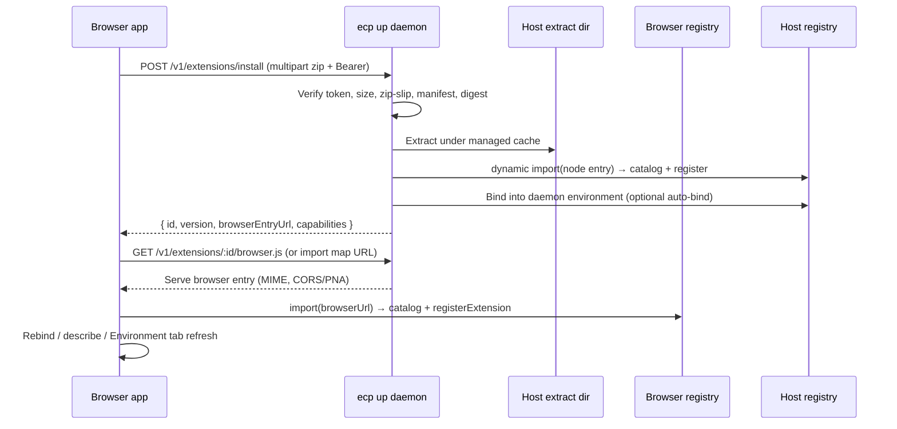

# Extension bundle sideload (zip → host → browser)

Status: **forward-looking proposal** (not implemented)  
Audience: protocol maintainers, CLI (`ecp up`), browser apps, extension authors  
Related: [`local-daemon-bridge.md`](./local-daemon-bridge.md), [`daemon-serve-implementation.md`](./daemon-serve-implementation.md), package `exports["."].browser` catalog graphs, `registry-control`, mixed-mode execution (`local` | `host` | `mixed`)

---

## Intent

Developers ship a **pre-built extension bundle** (zip) that already contains its runtime dependencies. A user (or Environment tab flow) **uploads that zip through the UI**. The **local host** (`ecp up`) receives, validates, extracts, and loads the **Node** graph. The **browser** loads only the **browser** graph (catalog and/or tab-safe handlers) served by that same host. Both sides register the same extension id so workflows authored in the tab can `describe` / bind / run, with host hops for native work.

This is the practical alternative to “type any npm id on a hosted demo and hope a CDN works”: **trust and resolution stay on the paired machine**, not on GitHub Pages or a public ESM CDN.

---

## Why this fits ECP

| Concern | How the zip model answers it |
| ------- | ---------------------------- |
| Native deps (`sharp`, Azure SDK, `node:fs`) | Stay on the **host** entry; browser never unpacks them into the tab |
| Hosted HTTPS demo | Page never runs `npm install`; it talks to `ecp up` (already the invoke/pairing path) |
| Peer dep duplication | Bundle **externalizes** `@executioncontrolprotocol/core` / `types` / `zod` against the host’s and page’s already-loaded copies |
| Dynamic Environment tab | Upload → install → register → bind; no demo rebuild |
| Policy | Same `registry-control` allowlist / `registerExtension` gates as today |

Execution names stay `local` | `host` | `mixed`. Bundler conditions stay `browser` | `node` | `import`. The zip is a **distribution unit**, not a new execution mode.

---

## Bundle shape (author contract)

A sideloadable artifact is a zip of a **built** package (or small multi-package folder), not a source tree that needs `npm install` on the user’s machine.

### Suggested layout

```text
my-ext-1.2.3.ecp-ext.zip
├── manifest.json          # ECP bundle metadata (required)
├── package.json           # name === extension id; exports browser/node/import
├── dist/
│   ├── index.js           # Node entry (may import native/SDK)
│   ├── index.browser.js   # Browser catalog (+ mixed handlers only)
│   └── index.d.ts
└── node_modules/          # optional: bundled deps EXCEPT ecp peers
    └── …                  # sharp, @azure/storage-blob, vendor SDKs, …
```

### `manifest.json` (sketch)

```json
{
  "schema": "@executioncontrolprotocol.extension-bundle",
  "version": "1.0",
  "id": "@vendor/my-ext",
  "packageVersion": "1.2.3",
  "ecp": {
    "types": "^0.12.0",
    "core": "^0.12.0"
  },
  "entries": {
    "node": "./dist/index.js",
    "browser": "./dist/index.browser.js"
  },
  "execution": {
    "default": "host",
    "capabilities": {
      "transform": "host",
      "upload": "mixed"
    }
  },
  "integrity": {
    "algorithm": "sha256",
    "packageDigest": "…"
  }
}
```

Rules aligned with current extension authoring:

1. **npm package name === extension id** (same as today).
2. **`exports["."].browser`** required if the Node graph has native/SDK imports.
3. **`catalogExtension(def)`** on both entries.
4. **Do not** ship a second copy of `@executioncontrolprotocol/core` / `types` inside `node_modules` for use as the registry — mark them `peerDependencies` / external; the host and browser inject the live modules.
5. Optional: declare `supportedRuntimes` / capability `.withExecution(...)` exactly as in source packages today.

### How authors produce the zip

CLI sketch (future):

```sh
ecp extension pack ./packages/my-ext -o my-ext-1.2.3.ecp-ext.zip
```

Implementation ideas:

- Run the package `build`.
- `npm pack` or copy `dist` + production deps.
- Prune or externalize ECP peers.
- Write `manifest.json` + digests.
- Zip. Fail if Node entry imports native modules but no `browser` entry exists.

Vendor packages in the [extensions](https://github.com/executioncontrolprotocol/extensions) repo are the first dogfood targets (`image-sharp`, `azure-blob-storage`).

---

## Runtime flow (upload → dual register)



### Host responsibilities

| Step | Behavior |
| ---- | -------- |
| Accept upload | Authenticated (`Bearer` pairing token), size limit, content-type |
| Safe extract | Reject zip-slip, symlinks out of root, absolute paths |
| Validate | `manifest.json` schema; `id` matches `package.json` `name`; ECP peer range compatible with daemon |
| Install | Extract to e.g. `~/.ecp/extensions/<id>/<version>/` (or project-local under `--env` workspace) |
| Load Node | `import(pathToFileURL(nodeEntry))` in the daemon process; `registerExtension` on host registry |
| Persist | Remember installed set across `ecp up` restarts (index file) |
| Serve browser graph | Static (or hashed) URL for `index.browser.js` **and** any relative JS it imports — **never** serve `node_modules/sharp` etc. to the browser |
| Policy | Install itself is a privileged action; gate with the same spirit as `registry.registerExtension` |

### Browser responsibilities

| Step | Behavior |
| ---- | -------- |
| Upload UX | Environment tab / Extensions panel: file picker → POST install |
| Load catalog | `import(browserEntryUrl)` or import map entry for the extension id |
| Register | `globalThis.ecp.registerExtension` / registry path already tested |
| Bind | Add `extension(id).with({…})` to the live environment (or auto-bind if policy allows) |
| Run | `local` / `mixed` handlers in tab; `host` via existing `remoteInvoke` → `POST /v1/invoke` |

No demo rebuild: the page only needs the **sideload client** once; each new zip is data.

---

## API surface (daemon additions)

Additive HTTP next to today’s `POST /v1/invoke` and `GET /health`:

| Method | Path | Purpose |
| ------ | ---- | ------- |
| `POST` | `/v1/extensions/install` | Upload zip; install + host register |
| `GET` | `/v1/extensions` | List installed sideload bundles |
| `GET` | `/v1/extensions/:id` | Manifest + status (host loaded? browser URL?) |
| `GET` | `/v1/extensions/:id/browser/*` | Serve browser graph files only |
| `DELETE` | `/v1/extensions/:id` | Uninstall; unregister if safe |

CLI mirrors for headless use:

```sh
ecp extension install ./my-ext.ecp-ext.zip
ecp extension list
ecp extension uninstall @vendor/my-ext
```

`ecp up --env …` continues to bind a base environment; sideloaded extensions are **additional** registrations on that host instance (policy permitting).

---

## Serving the browser graph without leaking Node

Critical invariant: the host’s static file server for `/v1/extensions/:id/browser/*` must expose **only** the browser closure.

Approaches (pick one in implementation):

1. **Pack-time split** — `ecp extension pack` writes `dist-browser/` with zero Node deps; host serves that tree only.
2. **Allowlist serve** — only files listed in `manifest.entries.browser` and a declared `browserFiles[]` digest list.
3. **Single-file browser bundle** — pack emits one `index.browser.bundle.js` (esbuild) with peers externalized; simplest to serve and hardest to accidentally include `sharp`.

Recommendation for v1: **(3) single-file browser bundle + external peers**, plus a CI/pack check that the browser artifact must not contain `from "sharp"`, `@azure/storage-blob`, or `node:`.

---

## Registration on both sides (same id)

```text
Host:  import(nodeEntry)     → catalogExtension + registerExtension(id)
Tab:   import(browserEntry)  → catalogExtension + registerExtension(id)
Env:   extension(id).with(config) on both (or host-only config + tab bind stub)
```

Describe/search in the tab see the same capability ids. Invoke of a `host` capability from the tab uses the existing hop. Mixed capabilities keep tab handlers from the browser entry and nested hops as today (e.g. Azure upload).

Config/secrets: prefer resolving secrets **on the host** for host caps; browser bind may pass `browser("KEY")` only for tab-local HTTP caps. Document that sideloaded host extensions should not expect vault secrets inside the zip.

---

## Trust and safety

Upload-to-host is **arbitrary code execution on the user’s machine**. Treat it like installing a local app plugin.

Minimum bar:

- Pairing token required; CORS/PNA as for invoke.
- Explicit user confirmation in UI (“Install @vendor/my-ext 1.2.3?”).
- Optional allowlist of id prefixes (`@customer/*`, `@executioncontrolprotocol/*`) via `registry-control`-style policy.
- Size limits; no network fetch during extract (deps must be inside the zip).
- Digest in manifest; optional later: signed bundles (publisher key / Sigstore).
- Do not auto-install from arbitrary URLs in v1 — **file upload or `ecp extension install <path>` only**.

Browser loading of the served catalog is still JS in the page origin (or blob URL). Prefer serving browser entries from the daemon origin the page already trusts for invoke, not injecting into a third-party CDN.

---

## Phased delivery

### Phase 0 — dogfood locally (no UI)

- `ecp extension pack` + `ecp extension install` against a running `ecp up --env`.
- Host dynamic `import` + register; browser manually imports a `file:` or localhost URL in Vite for bring-up.
- Tests: Sharp / Azure zips; browser artifact graph assertions; zip-slip rejection.

### Phase 1 — daemon HTTP install + browser fetch

- `POST /v1/extensions/install` + `GET …/browser/*`.
- Browser-demo (or any app): upload control + `registerExtension` + describe refresh.
- Environment tab: list sideloaded ids; still may be bind-only at first.

### Phase 2 — Environment tab “it just works”

- Editable environment Fluent: add `extension("@vendor/my-ext").with({})` after install.
- Auto-bind policy; uninstall/rebind; persistence across reload (query host `GET /v1/extensions`).

### Phase 3 — polish

- Signed bundles; version upgrades; multi-extension zip; import map generation for several sideloads; hosted-demo UX copy (“pair `ecp up`, then upload”).

Out of scope for this proposal: replacing npm publish for public packages; CDN “any npm id”; running native addons in the browser.

---

## Mapping to monorepo packages

| Piece | Likely home |
| ----- | ----------- |
| Bundle manifest types / Zod | `@executioncontrolprotocol/types` (+ schema generate) |
| Pack / validate / graph checks | `@executioncontrolprotocol/cli` (`ecp extension pack\|install\|…`) |
| Extract, load, serve, persist | `packages/cli/src/lib/up/` (daemon) + small core helper if reusable |
| Register / policy | Existing registry + `@executioncontrolprotocol/registry-control` |
| Browser client helper | `@executioncontrolprotocol/browser` or app-owned thin client (`installExtensionBundle(file)`) |
| Author docs | Public docs guide + extensions repo README; link from `AGENTS.md` |

Core stays free of Node zip I/O on the main barrel; pack/install I/O stays in CLI/node. Types and validation schemas can live in `types` / shared zod modules.

---

## Success criteria

1. Author packs `image-sharp` once; user uploads zip in a paired demo; tab `describe()` lists Sharp caps **without** rebuilding the demo.
2. Browser network panel never downloads `sharp` / `@azure/storage-blob` / `node:fs` modules.
3. Running a Sharp step hops to host and succeeds against the sideloaded Node entry.
4. Uninstall removes host registration and browser import map / registry entry.
5. Malicious zip paths and oversized archives are rejected with clear errors.

---

## Open questions

1. **Single-file browser bundle vs multi-file tree** — favor single-file for v1?
2. **Install scope** — user-global `~/.ecp/extensions` vs per-`--env` project directory?
3. **Auto-bind** — install implies environment bind, or bind only when Environment tab / Fluent says so?
4. **Version conflicts** — allow side-by-side versions or one active version per id?
5. **Relationship to npm** — is the zip a parallel channel only, or also what `ecp extension pack` publishes to a registry later?

---

## Summary

Pre-built zip sideload turns “dynamic extensions on the hosted demo” into a **host-mediated plugin install**: the daemon owns extraction and the Node graph; the browser only ever receives the package’s `browser` entry; both registries share the extension id; existing invoke hops keep native execution on the machine. That matches today’s catalog-export and mixed-mode work, and avoids relying on public CDNs or demo rebuilds for each new vendor package.
