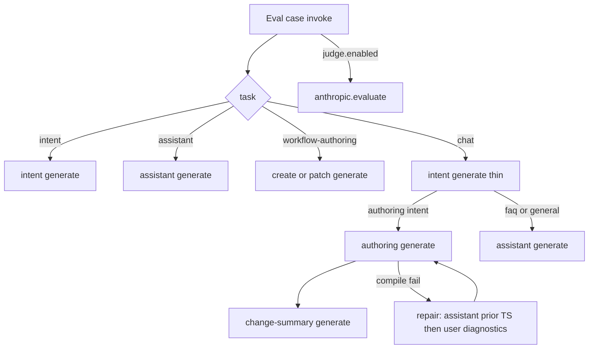

# Sonnet + Browser Coding harness: what the model sees

This note walks through **exactly what Claude Sonnet** (`claude-sonnet-4-5`) receives on each generate call when running the **Browser Coding** harness (`@executioncontrolprotocol/harness-browser-coding`) — so failures can be traced to a specific prompt surface.

Audience: harness / prompt authors tuning **medium** and **frontier** coding profiles. Nano (EQL) and the **small** profile (plain inventory + few-shot heavy) are out of scope except where noted.

---

## Snapshot

| Item | Value |
| --- | --- |
| Harness | `@executioncontrolprotocol/harness-browser-coding.evaluate` |
| Provider | `@executioncontrolprotocol/anthropic.generate` (+ `.evaluate` judge) |
| Model | `claude-sonnet-4-5` |
| Capability profile | **`medium`** (prompt fixtures + repair intensity; Opus → `frontier`) |
| Authoring surface | Fluent **TypeScript** only |
| Generate contract | `system` + optional prior `messages[]` + current `prompt` (+ optional `files` on the current turn) |
| Env inventory (authoring) | **`fluent`** catalog (id, label, typed I/O, `.with({...})` example) |
| Matrix env step inventory | Active provider generate + `@executioncontrolprotocol/test` (formats bound for host encode/decode but **stripped** from authoring `describe` summaries) |

**Important split:** profile (`small` / `medium` / `frontier`) only changes prompts and repair knobs. The **same** model is used for authoring generate and the LLM judge when the matrix uses Anthropic for both.

---

## Eval case → ordered generate calls

| Case harness | Generate sequence |
| --- | --- |
| `intent-classification` | 1× intent (+ repairs) |
| `workflow-assistant` | 1× assistant (+ repairs) |
| `workflow-authoring` (create/patch) | 1× create/patch (+ repair turns) |
| `chat` (create/patch/probe) | intent → authoring → change-summary (**3 shots**) |
| `chat` (faq/general) | intent → assistant |
| After any case with `judge.enabled` | separate `anthropic.evaluate` (not authoring context) |



Medium repair: up to **3** model calls per shot (`1 + maxAttempts` with `maxAttempts: 2`). Repair retries are **extra generate turns**, not a concatenated “error bullets only” rewrite.

---

## Shared system prompt assembly

Every coding shot builds `system` via `buildCodingSystemPrompt(fixtureId)` → `buildSystemPromptFromFixture`:

1. Optional **identity primer** (`identity: true` on some fixtures).
2. **TypeScript primer** for the output schema (intent / workflow / harness.reply) — Fluent I/O contract for workflows.
3. **Few-shots** — medium/frontier create/patch use **short Fluent grammar** (≤3 examples), not long ollama/echo clones. Live catalog replaces vendor teaching.
4. Fixture **`role`** + **`task`**.
5. Allowed values / intent definitions when present.
6. Closing: TypeScript only — no markdown fences.

**Not included for coding:** EQL primers, EQL few-shot headers, `format-eql` in matrix bindings or authoring inventory.

Medium fixture ids:

| Role | Fixture |
| --- | --- |
| Intent | `intent-classification-coding-medium` |
| Assistant | `workflow-assistant-coding-medium` |
| Create | `workflow-authoring-create-coding-medium` |
| Patch | `workflow-authoring-patch-coding-medium` |
| Change summary | `workflow-change-summary-coding-medium` |

---

## Generate payload shape

Every shot calls `callModelGenerate` → `anthropic.generate` with:

| Field | Meaning |
| --- | --- |
| `system` | Fixture assembly above |
| `messages` | **Prior** user/assistant turns only (omit/empty = single-shot) |
| `prompt` | **Current** user turn |
| `model` | e.g. `claude-sonnet-4-5` |
| `files` | Attach to the current user turn only (chat attachments) |

Providers map natively (Anthropic `/v1/messages`, Ollama `/api/chat`, OpenAI chat completions, Chrome `initialPrompts` + `session.prompt`). There is **no** vendor thread id / live session across UI turns — the host resends `messages[]`.

### 1. Intent classification (thin)

**Fixture:** `intent-classification-coding-medium`  
**Chat path:** `includeEnvironmentDescriptor: false` (forced in `multi-shot-chat.ts`).

**`messages`:** omitted (intent stays single-shot).

**`prompt` outline:**

```text
User message: <case message>
Routing hint: hasProbeContext=true (when live probe options exist)
Routing hint: hasBaselineWorkflow=true|false
Previous user message: <optional prior user turn>
```

No environment catalog. No Fluent source.

**On repair (small-style bullets):** feedback appended to the same prompt. Intent does not use repair-as-turns.

### 2. Workflow authoring — create / patch

**Fixtures:** create/patch coding-medium  
**Compile:** `compileWorkflowSource` → `@executioncontrolprotocol.workflow`

**`messages`:** host `conversationMessages` when present (demo: last N UI turns).

**`prompt` outline (create):**

```text
User request: <request>
Required import: import { workflow, step, ref } from "@executioncontrolprotocol/core" ...
<optional request capability hints>
Environment capabilities:
Fluent capability catalog (exact ids — copy step("...") values verbatim):

- @executioncontrolprotocol/anthropic.generate (generate) — inputs: prompt: string (required), ...; outputs: text: string
  example: step("@executioncontrolprotocol/anthropic.generate", "generate").id("generate").with({ prompt: "..." }).as("generate")
```

**`prompt` outline (patch):** same, plus Fluent edit rules and:

```text
Current workflow:
import { workflow, step, ref } from "..."
export default workflow("...")
  .id("...")
  .run([ ... ])
```

**On repair (medium/frontier):**

| Field | Content |
| --- | --- |
| `messages` | prior conversation + original authoring user prompt + `{ role: "assistant", content: <failed TypeScript> }` |
| `prompt` | compile/validation diagnostics (“Fix the previous TypeScript module…”) + fixture `repairHint` |

Failed source is **not** truncated for medium/frontier. Small profile may still concatenate repair bullets into one prompt without prior raw.

**Goal checks:** medium/frontier set `strictGoalChecks: false` — regex capability/label heuristics do not fail the repair loop (compile + schema validation still do).

### 3. Workflow assistant / change summary

**Fixture:** assistant or change-summary medium  
**Compile:** TypeScript `export const reply: HarnessReply`

**`messages`:** prior conversation when supplied.

**`prompt` outline:**

```text
Environment capabilities:
- ... (plain listing for assistant)
User message: <message or synthetic change-summary ask>
Run context (summary): ...
Workflow (summary): ...
```

If only a legacy `conversationSummary` string is supplied (no `conversationMessages`), it is prepended as “Conversation summary:”.

**On repair (medium/frontier):** same turn pattern as authoring (assistant = prior reply module, user = diagnostics).

### 4. Judge (`anthropic.evaluate`)

Separate from authoring. Receives artifact + rubric. Does **not** receive authoring system prompt, few-shots, or `messages`.

---

## Between attempts / between shots / between UI turns

| Transition | What carries | What resets |
| --- | --- | --- |
| Repair retry (medium/frontier authoring) | Same system; `messages` gain failed TS; `prompt` = diagnostics | Nothing reinjected as a fake transcript blob |
| Chat intent → authoring | Classified intent in host; conversation `messages` | New system (create/patch fixture); new user prompt with Fluent catalog |
| Chat authoring → summary | Authored workflow artifact; conversation `messages` | New system (change-summary); synthetic summary user message |
| Next UI turn | Host transcript → `conversationMessages` (demo: last 12 turns) | New chat = empty `messages` |
| Next eval case | Nothing | Fresh env invoke |

**What we do not send:** vendor conversation/thread ids, live Chrome LanguageModel sessions, full env inventory on intent, format-* / browser host caps in authoring inventory.

---

## Failure → surface map

| Theme | Surface / fix |
| --- | --- |
| Model ignores corrections | Ensure demo/host passes `conversationMessages`; authoring/assistant forward them to generate `messages` |
| Repair regenerates from scratch | Confirm `includePriorOutput` and repair-as-turns path (assistant = priorRaw) |
| Wrong capability / invented APIs | Fluent catalog in authoring prompt; thin few-shots |
| Over-constrained by regex goals | medium/frontier `strictGoalChecks: false` |
| Bad `.accepts` / `.returns` | TypeScript primer I/O contract + grammar few-shots |
| EQL leaking into coding | Fluent surface hints; no format-eql binding |

---

## Key source files

| Area | Path |
| --- | --- |
| Task dispatch | `packages/harnesses/browser-coding/src/browser-coding-harness.ts` |
| Profiles / repair | `packages/harnesses/browser-coding/src/harness-coding-config.ts` |
| Multi-shot chat | `packages/harnesses/browser-coding/src/multi-shot-chat.ts` |
| Conversation helpers | `packages/harnesses/browser-coding/src/conversation-messages.ts` |
| Intent / authoring / assistant | `*-coding.ts` under `src/` |
| Fluent catalog format | `packages/core/src/harness/authoring/summarize-environment.ts` (`format: "fluent"`) |
| Generate `messages` | `packages/types/src/model.ts`; providers map via `toProviderChatTurns` |
| Prompt fixtures | `packages/harnesses/browser-coding/fixtures/harness-prompts/` |
| Demo transcript | `browser-demo/src/lib/demo-conversation-messages.ts` |

Re-run:

```sh
pnpm run test:eval:matrix:coding:anthropic
```
