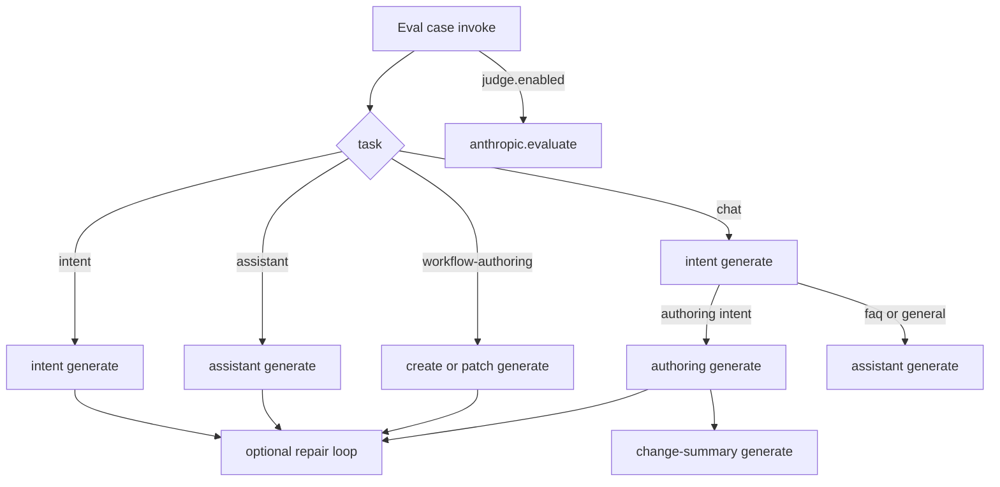

# Sonnet + Browser Coding harness: what the model sees

This note walks through **exactly what Claude Sonnet** (`claude-sonnet-4-5`) receives on each generate call when running the **Browser Coding** harness (`@executioncontrolprotocol/harness-browser-coding`) in the Anthropic coding eval matrix — so failures can be traced to a specific prompt surface.

Audience: harness / prompt authors tuning medium-capability models. Nano (EQL) is out of scope.

---

## Snapshot

| Item | Value |
| --- | --- |
| Harness | `@executioncontrolprotocol/harness-browser-coding.evaluate` |
| Provider | `@executioncontrolprotocol/anthropic.generate` (+ `.evaluate` judge) |
| Model | `claude-sonnet-4-5` |
| Capability profile | **`medium`** (prompt fixtures + repair intensity) |
| Authoring surface | Fluent **TypeScript** only (no EQL primer, no EQL repair lead-in, Fluent capability hints) |
| Matrix env step inventory | Active provider generate + `@executioncontrolprotocol/test` (formats bound for host encode/decode but **stripped** from authoring `describe` summaries; **`format-eql` unbound**) |
| Latest matrix | **98 passed / 0 failed** of 98 (`pnpm run test:eval:matrix:coding:anthropic`) |

**Important split:** profile (`small` / `medium` / `frontier`) only changes prompts and repair knobs. The **same** model is used for authoring generate and the LLM judge.

---

## Eval case → ordered generate calls

| Case harness | Generate sequence |
| --- | --- |
| `intent-classification` | 1× intent (+ up to 2 repair retries on medium) |
| `workflow-assistant` | 1× assistant (+ repairs) |
| `workflow-authoring` (create) | 1× create (+ repairs) |
| `workflow-authoring` (patch) | 1× patch (+ repairs) |
| `chat` (create/patch/probe) | intent → authoring → change-summary (**3 shots**) |
| `chat` (faq/general) | intent → assistant |
| After any case with `judge.enabled` | separate `anthropic.evaluate` (not authoring context) |



Medium repair: up to **3** model calls per shot (`1 + maxAttempts` with `maxAttempts: 2`).

---

## Shared system prompt assembly

Every coding shot builds `system` via `buildCodingSystemPrompt(fixtureId)` → `buildSystemPromptFromFixture`:

1. Optional **identity primer** (`identity: true` on some fixtures).
2. **TypeScript primer** for the output schema (intent / workflow / harness.reply) — includes Fluent I/O contract for workflows (object schema, `required` sibling array, generate returns as `object`).
3. **Few-shots** from the medium fixture (Fluent / reply examples using `ollama.generate` + `test.echo`).
4. Fixture **`role`** + **`task`**.
5. Allowed values / intent definitions when present.
6. Closing: TypeScript only — no markdown fences.

**Not included for coding:** EQL primers, EQL few-shot headers, `format-eql` in matrix bindings or authoring inventory.

Medium fixture ids:

| Role | Fixture |
| --- | --- |
| Intent | `intent-classification-coding-medium` |
| Assistant | `workflow-assistant-coding-medium` |
| Create | `workflow-authoring-create-coding-medium` |
| Patch | `workflow-authoring-patch-coding-medium` |
| Change summary | `workflow-change-summary-coding-medium` |

---

## Per-shot: what Sonnet sees

Every shot calls `callModelGenerate` → `anthropic.generate` with:

| Field | Source |
| --- | --- |
| `system` | Fixture assembly above |
| `prompt` | Task-specific user string (below) |
| `model` | `claude-sonnet-4-5` |
| `temperature` / `top_p` | Coding defaults (`0.1` / `0.9`) |
| `files` | Chat attachments only (not on intent) |

### 1. Intent classification

**Fixture:** `intent-classification-coding-medium`  
**Compile:** TypeScript `export const intent: EcpIntent`

**Chat path:** `includeEnvironmentDescriptor: false` (forced in `multi-shot-chat.ts`).  
**Standalone intent eval:** may include env lines when config enables them.

**User prompt outline:**

```text
User message: <case message>
```

Optional (standalone only):

```text
Environment capabilities:
- @executioncontrolprotocol/anthropic.generate ...
- @executioncontrolprotocol/test.echo ...
```

**On repair:**

```text
Previous attempt failed. Return corrected TypeScript only:
<formatFeedbackForModel issues>
<fixture repairHint>
```

### 2. Workflow authoring — create

**Fixture:** `workflow-authoring-create-coding-medium`  
**Compile:** `compileWorkflowSource` → `@executioncontrolprotocol.workflow`

**User prompt outline (excerpt structure):**

```text
User request: Create a minimal ... one step ... @executioncontrolprotocol/ollama.generate ...
Required import: import { workflow, step, ref } from "@executioncontrolprotocol/core" ...
Required: exactly ONE step(...) entry in .run([...]). Do not copy multi-step examples from the system prompt.
Pick a workflow .id() that matches this request ...
Required: 1 step(s) in .run([...]) in order (one step() per capability):
1. step("@executioncontrolprotocol/anthropic.generate", ...)
Environment capabilities:
- @executioncontrolprotocol/anthropic.generate ...
- @executioncontrolprotocol/test.echo ...
(formats omitted from authoring inventory; format-eql not bound)
```

**On repair (TypeScript surface — not EQL):**

```text
Previous attempt failed. Output only corrected TypeScript:
Fix the TypeScript module (do not repeat these lines):
- Request requires exactly one step in .run([...]) but output has 2. Export exactly one step(...).
Return corrected TypeScript only. ...
```

### 3. Workflow authoring — patch

**Fixture:** `workflow-authoring-patch-coding-medium`

**User prompt outline:**

```text
User request: Change the poem step label to Draft Poem.
Required import: import { workflow, step, ref } from "..."
Fluent edit rules:
- <deterministic Fluent hints from fluent-patch-hints.ts>
Current workflow:
import { workflow, step, ref } from "..."
export default workflow("...")
  .id("...")
  .run([ ... ])
Environment capabilities:
- ...
```

Baseline is rendered with `renderWorkflowToFluent` (Fluent source, not EQL).

### 4. Workflow assistant

**Fixture:** `workflow-assistant-coding-medium`  
**Compile:** TypeScript `export const reply: HarnessReply`

**User prompt outline:**

```text
Environment capabilities:
- ...
User message: Why did step poem fail?
Run context (summary):
- status, failed step ids, ...
Workflow (summary):
- plain-text step list (eql: false)
```

### 5. Change summary (chat shot 3)

Same assistant handler with change-summary fixture / synthetic message built by `buildChangeSummaryMessage` (before/after workflow + offer-run or offer-probe). Shot task recorded as `workflow-change-summary` in the chat trace.

### 6. Judge (`anthropic.evaluate`)

Separate from authoring. Receives:

- harness **artifact** (workflow or reply)
- `goal` / `criteria` (rubric) from the case
- optional `classifiedIntent`
- **same** `model: claude-sonnet-4-5`

Does **not** receive the authoring system prompt or few-shots.

---

## Between attempts / between shots

| Transition | What carries | What resets |
| --- | --- | --- |
| Repair retry within a shot | Same system; user prompt gains repair block + hint | Prior raw output **not** reinjected in coding authoring today |
| Chat intent → authoring | Classified intent in host only | New system (create/patch fixture); new user prompt with env + request |
| Chat authoring → summary | Authored workflow artifact | New system (change-summary); synthetic summary user message |
| Next eval case | Nothing | Fresh env invoke |

---

## Failure → surface map

| Theme (pre-fix) | Surface / fix |
| --- | --- |
| Chrome fixture skew | Create cases/few-shots now use `ollama.generate` (+ Anthropic substitution) |
| Over-building + test.summarize | Fluent one-step hints; do not map verb “summarize” to `test.summarize` when a `*.generate` id is already named |
| Bad `.accepts` / `.returns` | TypeScript primer I/O contract + create/patch few-shots; fixed property inference / rename-returns preserve logic |
| Brittle `error` substring | Prefer `citationStepId` / step mention; tone via judge rubric |
| Same-model judge-only patch | `wf-patch-10` now deterministic `stepLabel` |
| EQL in repair / hints | `formatStructuredRepairForModel(..., "typescript")`; Fluent `surface` on capability hints |
| Probe shotCount 3≠2 | Fixture expects 3 shots (intent → authoring → change-summary) |

---

## Matrix results (post-change)

**98 passed / 0 failed** of 98.

### Passing classes

- Intent routing (full suite)
- Assistant Q&A (env-available caps; no Chrome / format-eql listing)
- Create/patch including I/O and clear-steps-keep-I/O
- Chat create/patch/probe with 3-shot authoring graph

### Themes fixed in this pass

1. Chrome create cases rewritten to `ollama.generate` (Anthropic substitution → live generate).
2. Few-shots use `ollama.generate` + `test.echo`; no Chrome / format-eql teaching.
3. Fluent I/O contract in TypeScript primer + create/patch tasks + I/O few-shots.
4. EQL removed from coding repair lead-in and Fluent capability/step-count hints; `format-eql` unbound from coding matrix.
5. Softened brittle `error` asserts; hardened `wf-patch-10`; probe shot-count aligned to orchestrator.
6. Capability inference no longer pulls `test.summarize` when a generate id is already explicit.

---

## Key source files

| Area | Path |
| --- | --- |
| Task dispatch | `packages/harnesses/browser-coding/src/browser-coding-harness.ts` |
| Profiles / repair | `packages/harnesses/browser-coding/src/harness-coding-config.ts` |
| Multi-shot chat | `packages/harnesses/browser-coding/src/multi-shot-chat.ts` |
| Intent / authoring / assistant | `*-coding.ts` under `src/` |
| Fluent patch / I/O feedback | `packages/harnesses/browser-coding/src/fluent-patch-hints.ts` |
| Prompt fixtures | `packages/harnesses/browser-coding/fixtures/harness-prompts/` |
| TypeScript primer / I/O contract | `packages/core/src/harness/prompts/typescript-primer.ts` |
| Structured repair surface | `packages/core/src/harness/authoring/presentation.ts` |
| Capability hints (Fluent surface) | `packages/harnesses/browser-nano/src/_internal/request-capability-hints.ts` |
| Repair loop | `packages/core/src/harness/run-model-repair-loop.ts` |
| Anthropic matrix helpers | `packages/harnesses/browser-coding/test/eval/helpers/coding-*.ts` |

Re-run:

```sh
pnpm run test:eval:matrix:coding:anthropic
```
